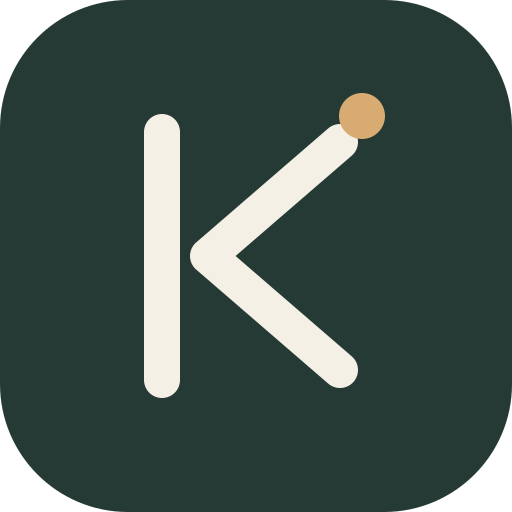
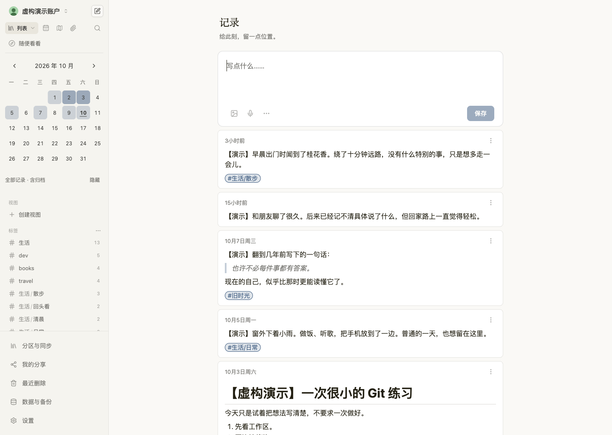
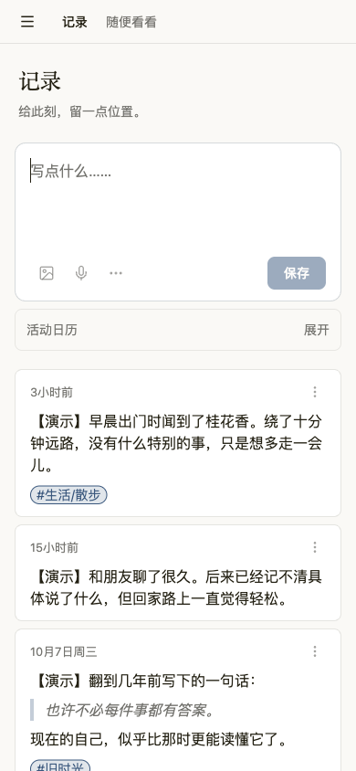
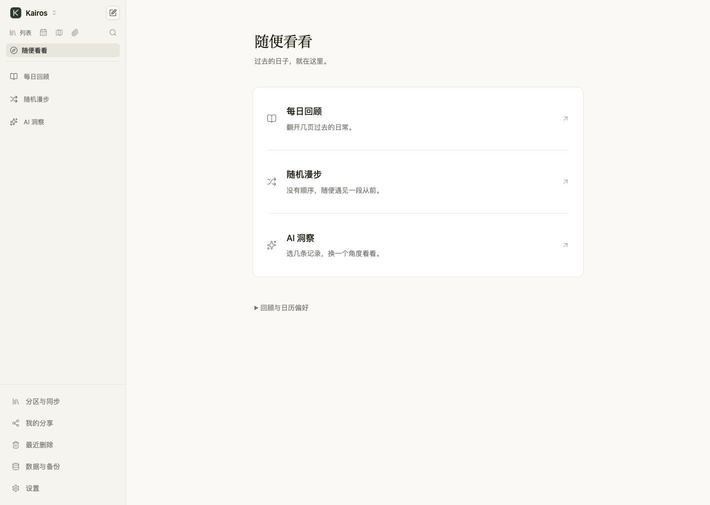
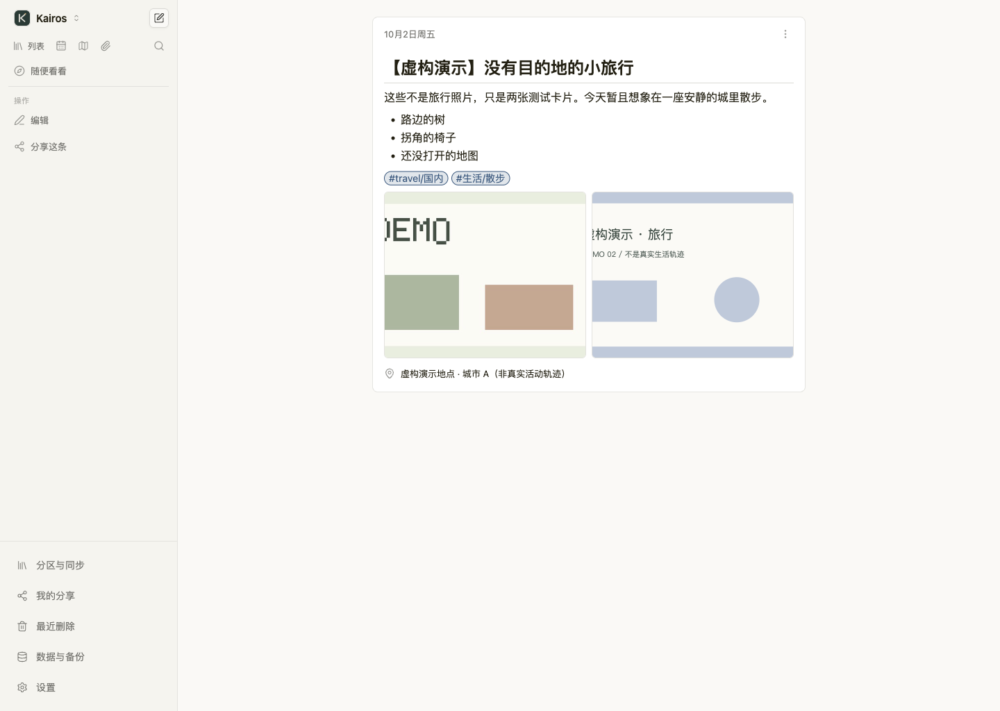
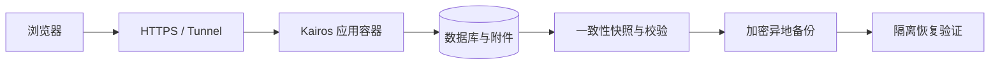

<p align="center"></p>

<h1 align="center">Kairos</h1>
<p align="center"><strong>留下此刻，日后重逢。</strong><br>Keep a moment. Meet yourself again.</p>

Kairos 是一个私密、轻松、可以长期保存的生活记录工具。留下当时的文字、照片与声音，让多年后的自己仍能读到真实的生活。

[开始使用](#快速开始) · [使用说明](docs/usage.md) · [部署与恢复](docs/operations/deployment.md) · [需求与已知问题](https://github.com/EgoSay/kairos/issues/32) · [MIT License](LICENSE)



## 为什么做 Kairos

当文字和图像越来越容易生成，亲身经历过的片段、当时的语气和自己的视角，值得被认真保存。

一条记录可以是一句没想完整的话、一张路上的照片，也可以是几个月之后才补写的往事。它不必有标题、分类、结论，或值得分享的理由。多年后重新打开时，仍能读到那个时刻的自己。

Kairos 的名字取意于古希腊的“契机、恰当的时刻”。在这里，留下什么、什么时候回来，都由本人决定。

## 设计哲学

- **记录本身已经完整。** 保存之后，不追加标签、总结、心情评分或下一条输入的任务。
- **允许间断。** 活动日历展示积累，空白日期保持中性；没有断签惩罚和补记压力。
- **本人拥有解释权。** 保留原话，也允许修改。AI 在主动选定来源后提供阅读角度，不替本人定义人生。
- **主动回顾。** 每日回顾和随机漫步是可进入、可忽略、可随时离开的去处。
- **私密与自主。** 默认私密；分享和分区外发有明确范围，可以查看、暂停和撤销。
- **多年后仍可读取。** 草稿保护、原件、导出、备份和恢复是产品的基础。保存失败必须看得见。

取舍顺序是：**数据与隐私 → 本人控制权 → 记录的低负担 → 找回与阅读 → 探索的乐趣 → 装饰。** 完整约定见 [BRAND.md](BRAND.md)。

## 当前可以做什么

| 场景 | 当前能力 |
| --- | --- |
| 随手记录 | 文字、照片与音频；可选标签、日期、位置和个人分区；本机草稿与离线待同步 |
| 找回片段 | 时间线、搜索与筛选、日历、地图；标签辅助整理 |
| 随便看看 | 每日回顾、随机漫步；主动选择记录后使用 AI 洞察 |
| 自己掌控开放范围 | 固定或动态只读分享、范围预览、提取码、暂停与期限；按分区配置外部投递 |
| 修改与恢复 | 编辑版本、最近删除、可阅读的个人 ZIP 档案及导入恢复 |
| 长期保存 | 自托管数据库和媒体；实例快照、加密远端备份与隔离恢复工具 |

AI 需要自己的服务配置；外部投递需要接收服务，不等于已支持所有社媒平台。离线冷启动需要此前成功联网打开应用，浏览器草稿尚未同步时不在服务器备份里。

产品持续完善中：搜索简化、图片粘贴体验、定位、聚焦入口、关联记录、附件预览与回收站联动，以及产品内的 S3 定时备份配置和监控页，均在 [需求清单 #32](https://github.com/EgoSay/kairos/issues/32) 跟进。现有备份脚本与待开发的管理页面分别说明，不将规划当作已发布能力。

## 看看实际界面

以下截图来自 Kairos 的本地演示实例，使用虚构记录，不包含私人账号或生产数据。手机图展示响应式 Web 布局。

| 手机随手记录 | 日历找回 |
| --- | --- |
|  |  |





## 快速开始

需要 Git 和带 Compose 的 Docker。以下方式从自己的源码构建完整镜像，默认只在本机开放端口：

```sh
git clone https://github.com/EgoSay/kairos.git
cd kairos
KAIROS_VERSION="$(bash scripts/release_version.sh development-version)" \
KAIROS_COMMIT="$(git rev-parse HEAD)" \
  docker compose -f scripts/compose.yaml up -d --build
```

打开 **http://localhost:5230**，创建自己的管理员账户。记录保存在 Compose 的 `kairos-data` 卷；停止或更新容器时保留该卷。首次构建会下载 Node、Go 和项目依赖。

```sh
# 查看健康状态和日志
docker compose -f scripts/compose.yaml ps
docker compose -f scripts/compose.yaml logs --tail=100 kairos

# 停止容器，保留数据卷
docker compose -f scripts/compose.yaml down
```

在服务器上运行时，先完成账户初始化，再配置 HTTPS 和入口。生产部署、既有实例升级和恢复见 [部署说明](docs/operations/deployment.md)。镜像发布目标为 `ghcr.io/egosay/kairos`，生产实例使用确认过的固定 digest；不依赖上游镜像的 `stable` 或 `canary` 标签。

## 部署与数据保障

Kairos 是 **Go 服务 + 内嵌 React 前端 + 数据库与附件**，一个应用容器即可运行。默认使用 SQLite，也保留 MySQL、PostgreSQL 存储支持。公网入口可接现有反向代理或 Cloudflare Tunnel。



- **个人档案**：导出可解压阅读的 Markdown、媒体和元数据，用于带走自己的内容。
- **实例备份**：保存账户、数据库和媒体，用于恢复服务；使用一致性快照并验证完整性。
- **远端保障**：已有脚本支持 SQLite 与本地附件的 restic 加密备份；调度、R2/S3 凭据和监控需要另行配置。备份完成、状态上报和实际恢复是不同结果。
- **发布**：版本标签触发 GitHub 构建和检查，通过预备份后更新固定 digest 的生产声明，Dokploy 据此部署。普通提交与合并不自动上线。

数据卷不是异地备份。MySQL/PostgreSQL、外部对象存储附件需要与各自一致性机制配套；现有 SQLite 快照脚本会拒绝它不能完整保护的外部媒体，不会静默漏备份。

[完整部署与恢复](docs/operations/deployment.md) · [备份及发布工具](scripts/README.md) · [日常运行说明](docs/operations/personal-journal.md)

## 一起维护

Kairos 从自己的使用需要出发持续迭代。遇到问题或有想法，可以在 [Issues](https://github.com/EgoSay/kairos/issues) 描述具体场景。现有功能的可靠性和低负担体验优先。

本地开发、检查和 PR 约定见 [CONTRIBUTING.md](CONTRIBUTING.md)，目录与工程规则见 [AGENTS.md](AGENTS.md)，接口说明见 [API 文档](docs/api.md)。

## 许可与来源

Kairos 基于 [Memos](https://github.com/usememos/memos) 发展，感谢原项目及其贡献者。产品方向、品牌和维护入口由本项目独立维护。

代码按 [MIT License](LICENSE) 开放，保留原版权声明并注明 Kairos 新增贡献。旧 API、导出格式与部分配置名称保留兼容性，具体边界见 [兼容与迁移](docs/operations/deployment.md#兼容与迁移)。
